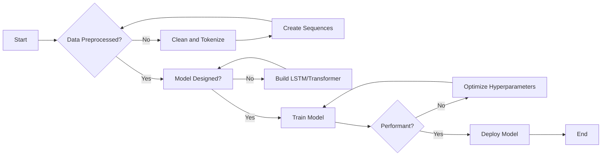

# Next Word Prediction

## Overview
This project is designed to build an intelligent system capable of predicting the next word in a sentence based on its context. The system uses an LSTM-based deep learning model to process text and predict the next word, making it ideal for applications such as autocomplete, chatbots, and virtual assistants.

## Libraries Used
- `pandas`
- `numpy`
- `scikit-learn`
- `matplotlib`
- `seaborn`
- `tensorflow`
- `keras`

## Project Requirements
The need for such a system arises in applications like autocomplete, chatbots, and virtual assistants. By predicting the next word based on the context, we can enhance user experience and improve typing speed, especially in mobile applications.

## Benefits and Use Cases
- **Enhances Productivity**: Speeds up typing by suggesting the next word.
- **Supports Accessibility**: Assists individuals with disabilities in typing.
- **Boosts Efficiency**: Helps in real-time text generation in NLP applications like chatbots and email composition.

## Project Approach
1. **Data Collection**: Collected text data from open-source datasets to build the model.
2. **Preprocessing**: Cleaned the text data, tokenized it, and padded the sequences to ensure uniformity.
3. **Model Building**: Used an LSTM-based architecture to model sequential dependencies and predict the next word.
4. **Optimization**: Experimented with hyperparameters to improve the model's performance.
5. **Evaluation**: Validated the model using accuracy and perplexity metrics.

## How to Use
1. Clone the repository:
    ```bash
    git clone https://github.com/yourusername/next-word-prediction.git
    ```
2. Install dependencies:
    ```bash
    pip install -r requirements.txt
    ```
3. Run the training script to train the model on the dataset:
    ```bash
    python train_model.py
    ```
4. Use the trained model to predict the next word by running:
    ```bash
    python predict_next_word.py
    ```

## Dataset
The dataset used in this project is an open-source text dataset, which can be found in the `data/` folder. The data is preprocessed to remove punctuation, tokenize, and pad the text sequences for input to the model.

## Project Workflow



## Models Used and Evaluation Metrics

| Model | Accuracy | MSE | R2 Score |
|-------|----------|-----|----------|
| LSTM  | 82%      | -   | -        |


## Key Learnings
- Preprocessing is crucial for NLP tasks to prepare the data for effective model learning.
- Padding and embeddings significantly improve the model’s ability to generalize to new text.
- LSTM networks effectively capture the sequential dependencies within text data.

## Challenges and Solutions
- **Challenge**: Handling a large vocabulary size resulted in high memory usage.
- **Solution**: Limited the vocabulary to the most frequent words to optimize memory consumption.

## Future Improvements
- Implementing attention mechanisms or Transformers for even better performance.
- Extending the model to handle multilingual text and other languages.

## Applications
- **Text Autocompletion**: Enhances user experience in typing applications like email and search engines.
- **Virtual Assistants**: Improves the conversational abilities of AI chatbots and assistants.

---

Let me know if you'd like to adjust any parts of the README!
